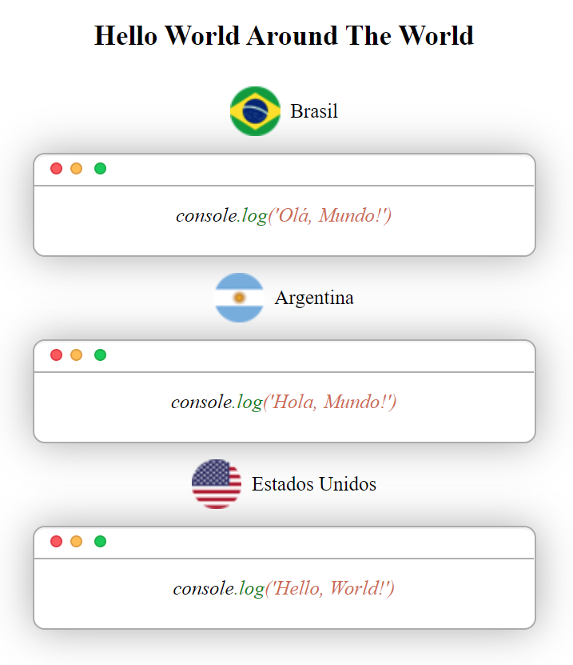

# hello-world-showcase

## Just a simple hello world showcase made with React (yarn create react-app).

## How to contribute:

1. Fork this project and clone it using git/yarn.
2. Choose a country of your preference and download the icon from here: https://www.countryflags.com/icons-overview/ (Country > Icon > 32x32 png format);
3. Rename the file to "countryname.png" and save the png in the public > img folder;
4. Go to App.jsx and add the new country information following this template:
<pre> <code>
{
name: "countryName",
title: "countryName",
img: "img/countryname.png",
text: (change the content of the last span to the country's respective hello world),
},
</code>
</pre>

5. Commit your changes and create the pull request!
